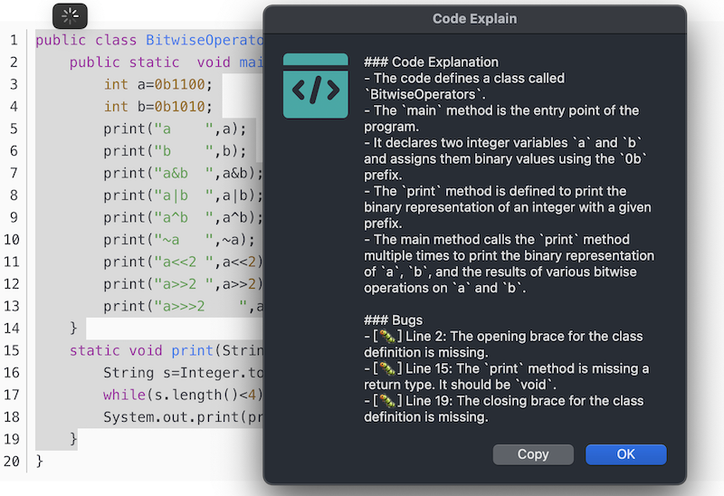

# popclip-extension-GPT-assistant

This extension provides 3 functions: polishing, summary, and code explanation

- Polishing: discover and correct spelling errors and improve text expression
- Summary: extract a summary of a piece of text
- Code explanation: explain the function of a piece of code and point out code bugs

## Setting

## Polishing

## Summary

## Code explain

